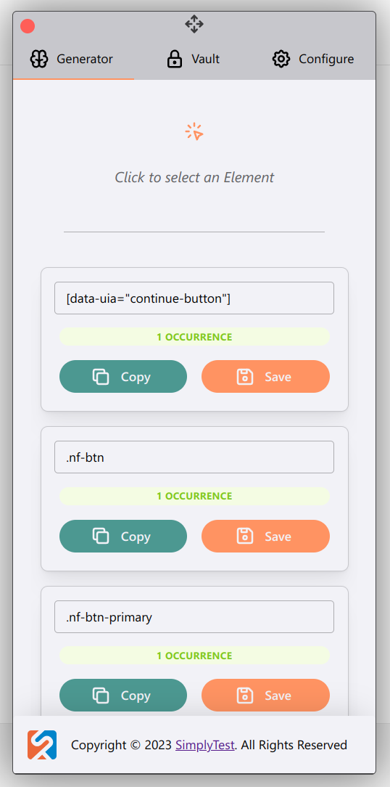
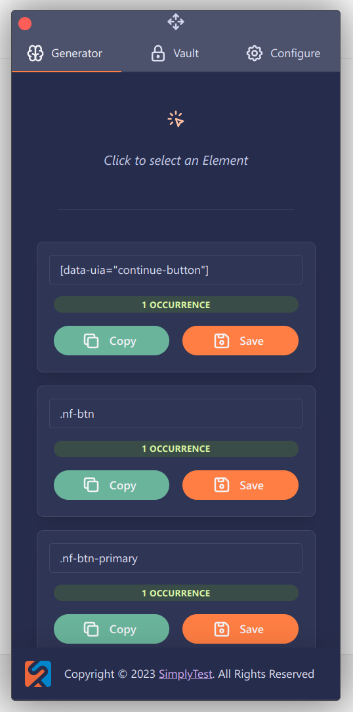

### STargazer <i>2</i>

# 👋 Introduction
STargazer is a chrome extension that can generate selectors for a given element.

# 🔭 Features

* 🧠 <kbd>XPath</kbd> and <kbd>CSS</kbd> supported

* 🔃 Sync with Dev-Tools inspected Element

* 📚 Save Selectors
  * 🖼️ With Preview Image

* 🤖 Automatic Page-Object File Generation
  * Supports multiple Languages (e.g. <kbd>C#</kbd>, <kbd>TypeScript</kbd>, <kbd>Java</kbd>, ...)

* 🌙 Dark and ☀️ Light-Theme

# 🖼️ Screenshots

| ☀️ Light                                | 🌙 Dark                               |
| -------------------------------------- | ------------------------------------ |
|  |  |

# 📦 Installation

STargazer can be downloaded from the [Chrome Web-Store](https://chrome.google.com/webstore/detail/stargazer/mkphjcfplanogllpfpfefcpfbdpchkjh).

Alternatively, you can also install the nightly builds from [Github Actions](https://github.com/simplytest/STargazer/actions), see also: 
- [How to load an unpacked extension](https://developer.chrome.com/docs/extensions/mv3/getstarted/development-basics/#load-unpacked)

---

> Made by [SimplyTest](https://simplytest.de/)